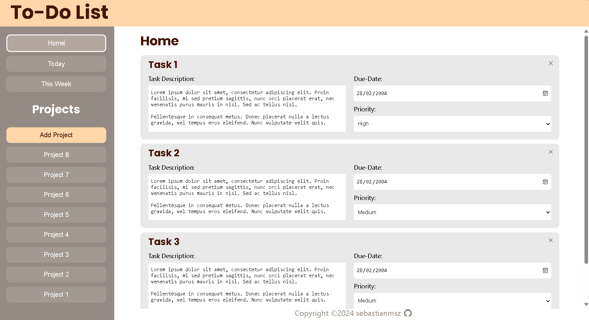

# Todo-list Web App ✏️✅

This is a todo web app built with webpack. It enables you to create, update, and delete tasks and groups of tasks. The main goal of building this app was to learn webpack and its capabilities for bundling and optimizing JavaScript applications, while also enhancing my JavaScript skills.

## Screenshot


## Live Demo
Experience the app by clicking [here](https://sebastianmsz.github.io/todo-list).

## Installation

1. Clone the repository:

    ```bash
    git clone https://github.com/sebastianmsz/todo-list.git
    ```

2. Install the dependencies:

    ```bash
    npm install
    ```

## Usage

1. Start the development server:

    ```bash
    npm start
    ```

2. Open your web browser and navigate to `http://localhost:8080`.

3. You can now start adding, updating, and deleting tasks in the app.

## Project Structure

The project is organized into the following directories:

- `src`: Contains the JavaScript modules and UI components.
- `dist`: Contains the bundled and optimized files generated by webpack.

## Technologies Used

- Webpack: A module bundler for JavaScript applications.
- JavaScript: The programming language used for the app's logic.
- HTML: The markup language used for the app's user interface.
- CSS: The styling language used for the app's UI.

## Contributing

Contributions are welcome! If you find any issues or have suggestions for improvements, please open an issue or submit a pull request.

## Contact
If you want to contact me you can reach me via email at sebastian.msz@proton.me. 